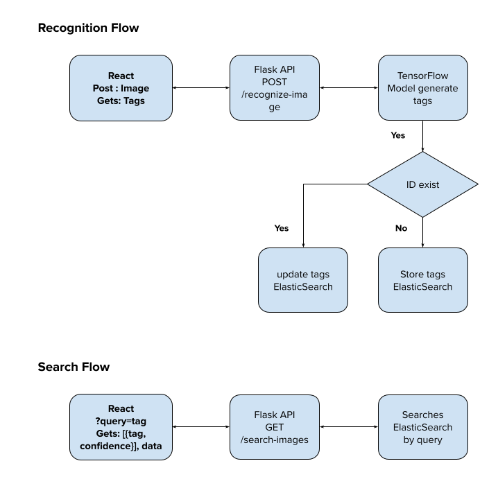

# Proof of Concept: Image Recognition with Flask, TensorFlow, and Elasticsearch

A full stack POC where users can upload images, recognize tags using a Python Flask API, store the tags in Elasticsearch, and search for recognized tags through the React front-end. Solution for handling image recognition and retrieval.

## Project Overview

This proof of concept (POC) allows users to upload images, process them with a Python Flask API for image recognition using TensorFlow, store recognized tags in Elasticsearch, and search for images based on the tags through a React front-end.



## Technologies Used

- **Front-end**: React
- **Back-end**: Flask/[Tensorflow](https://www.tensorflow.org/api_docs/python/tf/keras/applications/MobileNetV2) (Python) for image recognition
- **Search**: Elasticsearch for storing and querying recognized tags

### Run Your Application

Make sure your Elasticsearch server is running. [See more](https://www.elastic.co/guide/en/elasticsearch/reference/current/run-elasticsearch-locally.html)

- Start your Flask server:

```bash
cd server
python3 app.py
```

- Start your React app:

```bash
cd client-swc
npm run dev
```

### Testing the Application

1. Open your browser and navigate to `http://localhost:5173/`.
2. Upload an image and click "Recognize Image" to process it and store the tags in Elasticsearch.
3. Enter a search query in the search bar and click "Search" to retrieve images associated with the specified tags.
4. To clear elasticsearch data run: `curl -u <user>:<password> -X DELETE 'http://localhost:9200/images'`
